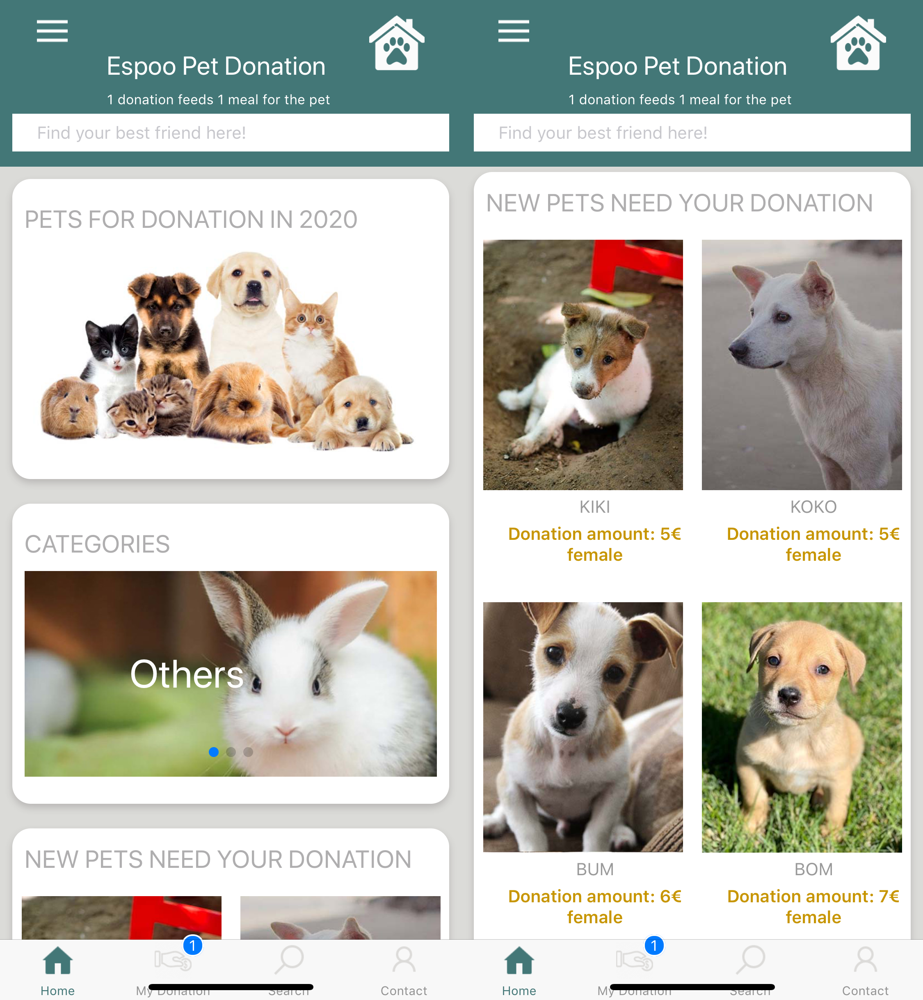
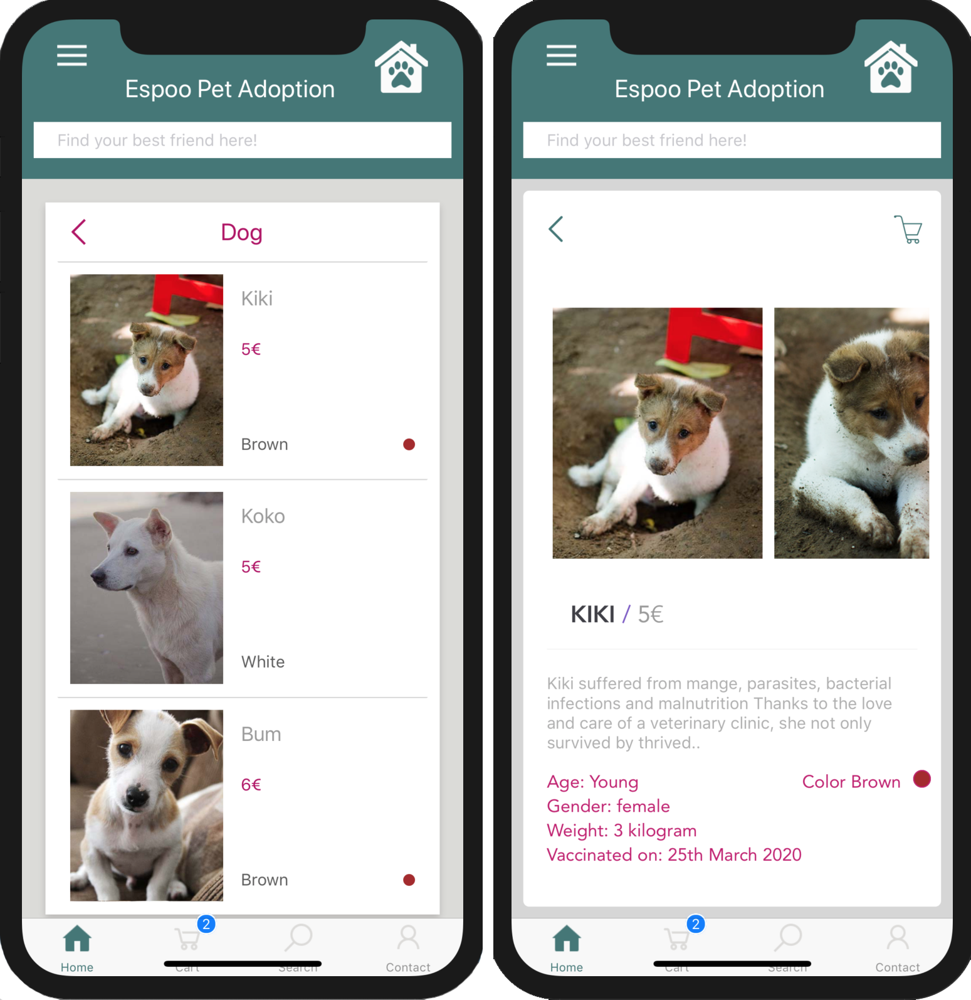
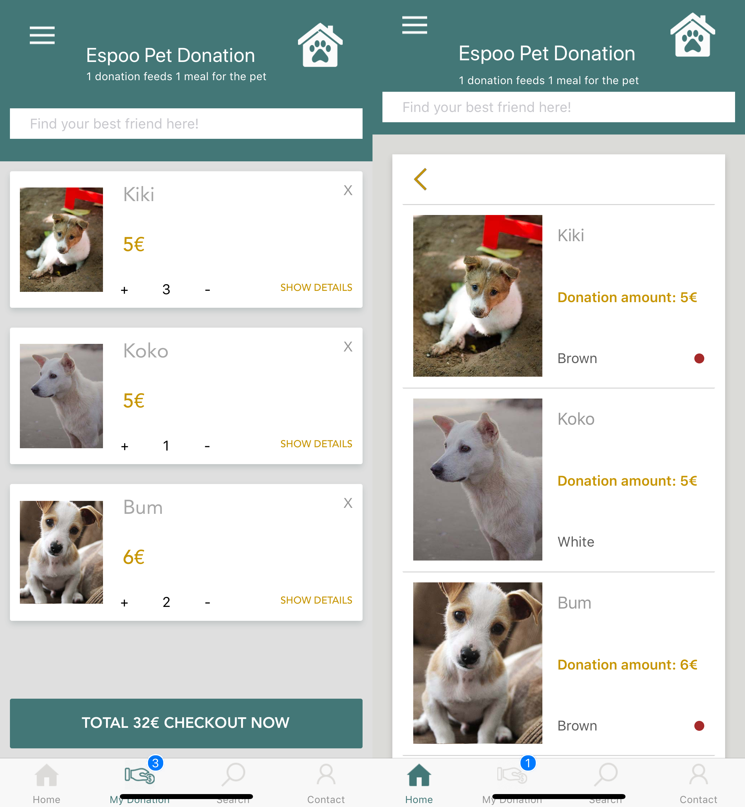
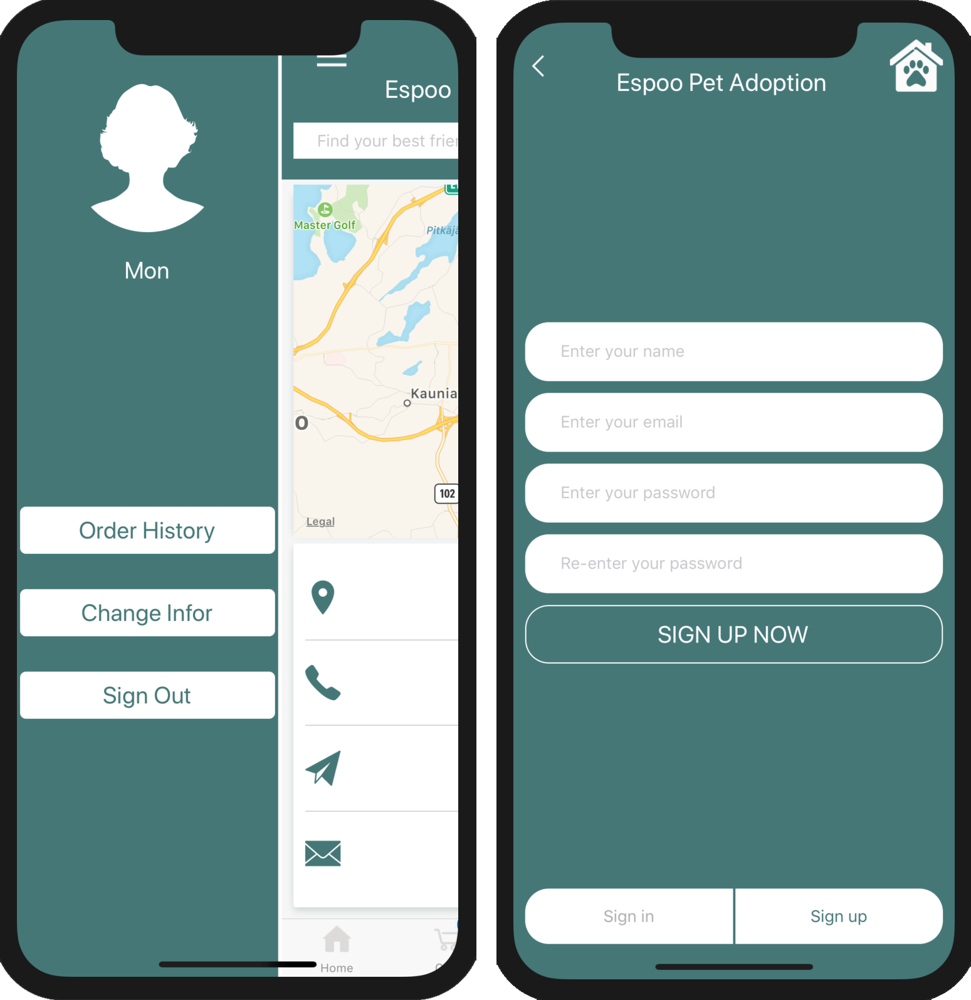

# PET ADOPTION APP
=====================

An app for user to find and adopt abandoned dog, cat and other pets.

Running Tests
-------------
## Backend- PHP
Download and install MAMP OR XAMP.
Put the pet-adoption-server folder into htdocs folder of MAMP or XAMP.
Start the Apache Web Server & MySQL Databases.

## Frontend- React native
In the app directory, use: 
```
react-native run-ios
```
OR
```
react-native run-android
```

### Homepage



### List 


### Details



### Cart



### Side Drawer



### Sign-in


