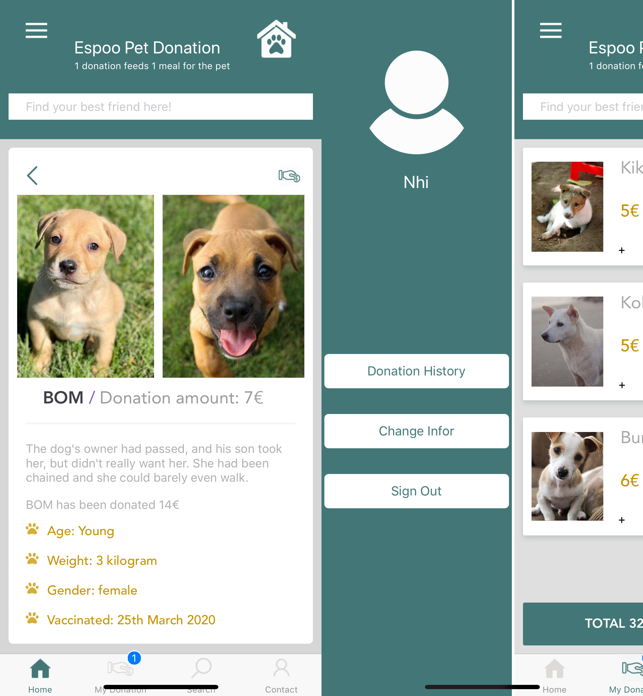

# PET ADOPTION APP
Demo clip: https://youtu.be/sTjhpTI7gCk
=====================

An app for user to find and adopt abandoned dog, cat and other pets.

## Running Tests
-------------
### Backend- PHP
Download and install MAMP OR XAMP.
Put the pet-adoption-server folder into htdocs folder of MAMP or XAMP.
Start the Apache Web Server & MySQL Databases.

### Frontend- React native
In the app directory, use: 
```
react-native run-ios
```
OR
```
react-native run-android
```

### Homepage


### List of category & Details



### Contact & Cart


### Login & Side Drawer


